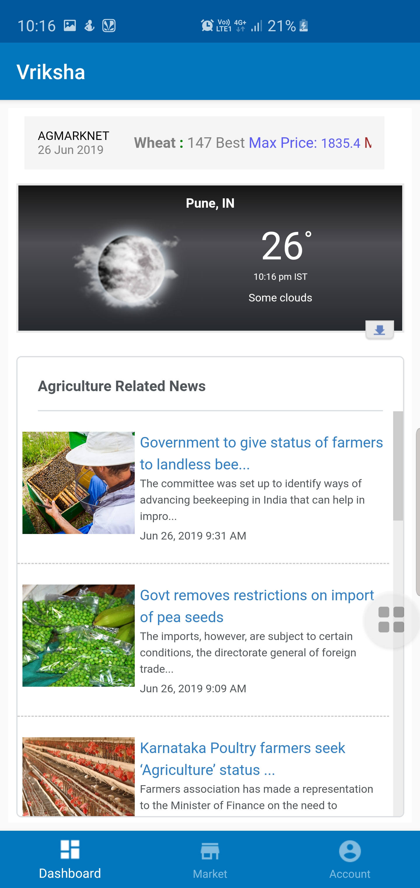
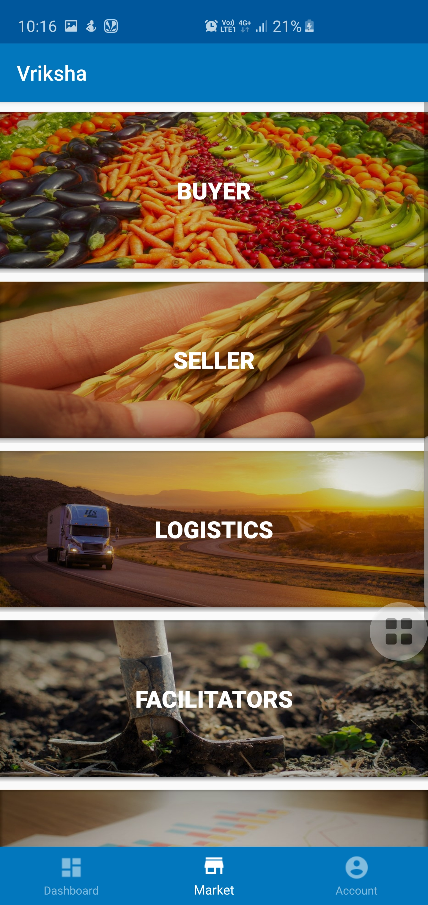
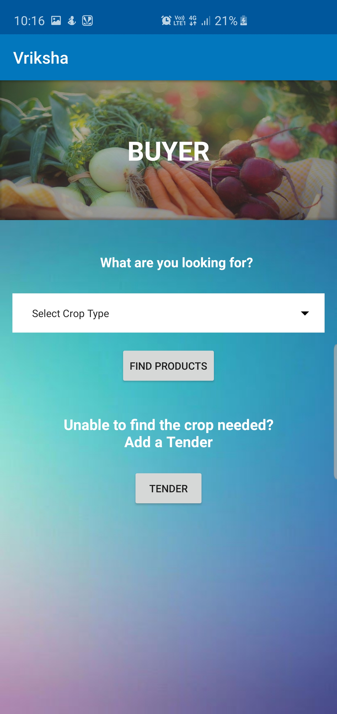
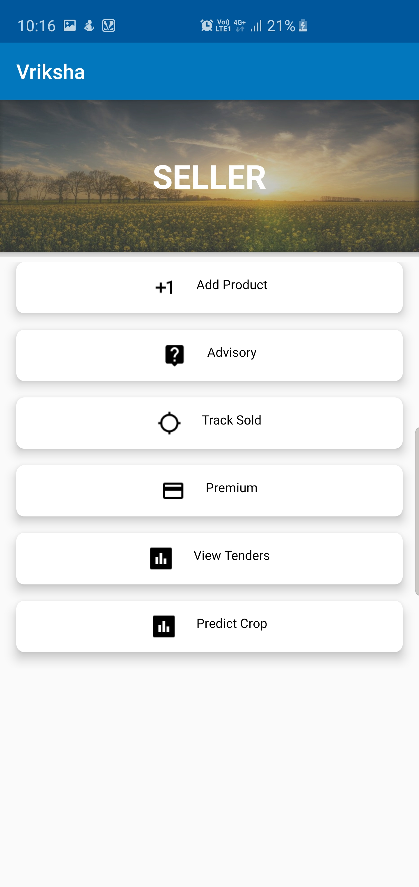
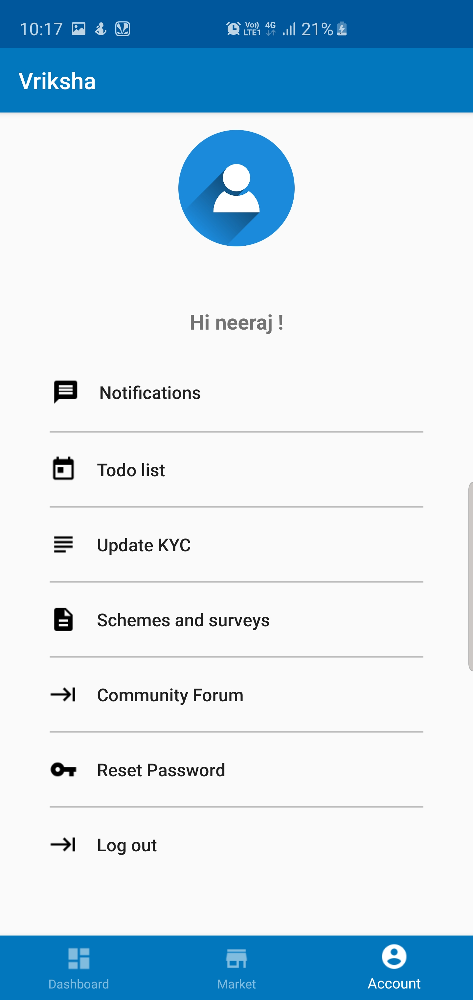
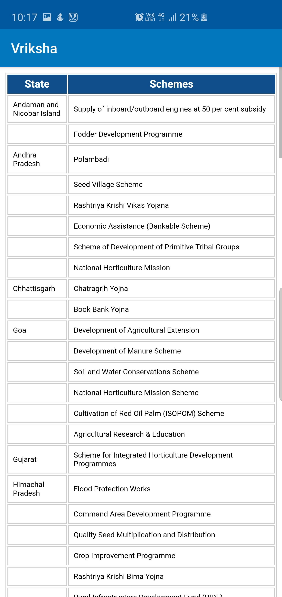

# Vriksha 2017
An app made for Smart India Hackthon 2017.An idea to help farmers of India to sell their products at much higher rate and with ease. With a vision change the agriculture industry in India.

<table>
  <tr>
    <td>Dashboard with latest news and crop prices</td>
     <td>Home Page</td>
     <td>Buyer Page (purchase/tender)</td>
  </tr>
  <tr>
    <td></td>
    <td></td>
    <td></td>
  </tr>
  <tr>
    <td>Seller's home page</td>
     <td>Profile Section</td>
     <td>Page with region specific schemes</td>
  </tr>
  <tr>
    <td></td>
    <td></td>
    <td></td>
  </tr>
 </table>
